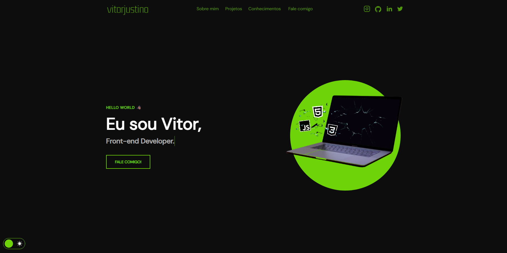

# 🧑‍💻 Portfólio Pessoal - Vitor

Este é meu portfólio pessoal como desenvolvedor Front-end. Aqui você encontra alguns dos meus projetos, habilidades e formas de contato profissional.

## 🚀 Tecnologias

- HTML5
- CSS3
- JavaScript

## 💼 Projetos em destaque

- **VDD Studios** – Agência digital de design e web.
- **Academia UNIBARRETOS** – Dashboard de treinos em React.
- **Barber Web** – Site para agendamentos de cortes de cabelo.

## 🌐 Acesse

Você pode acessar o portfólio online aqui:  
👉 [Ver Portfólio](https://SEU_USUARIO.github.io/NOME_DO_REPO)

## 📬 Contato

Entre em contato comigo através do [WhatsApp](https://wa.me/5517981117587?text=Olá%2C+vim+pelo+seu+portfólio!) ou pelo e-mail: **vitor.justino@faculdadebarretos.com.br**

---

© 2025 - Vitor. Todos os direitos reservados.

Este é meu portfólio pessoal como desenvolvedor Front-end. Aqui você encontra alguns dos meus projetos, habilidades e formas de contato profissional.
